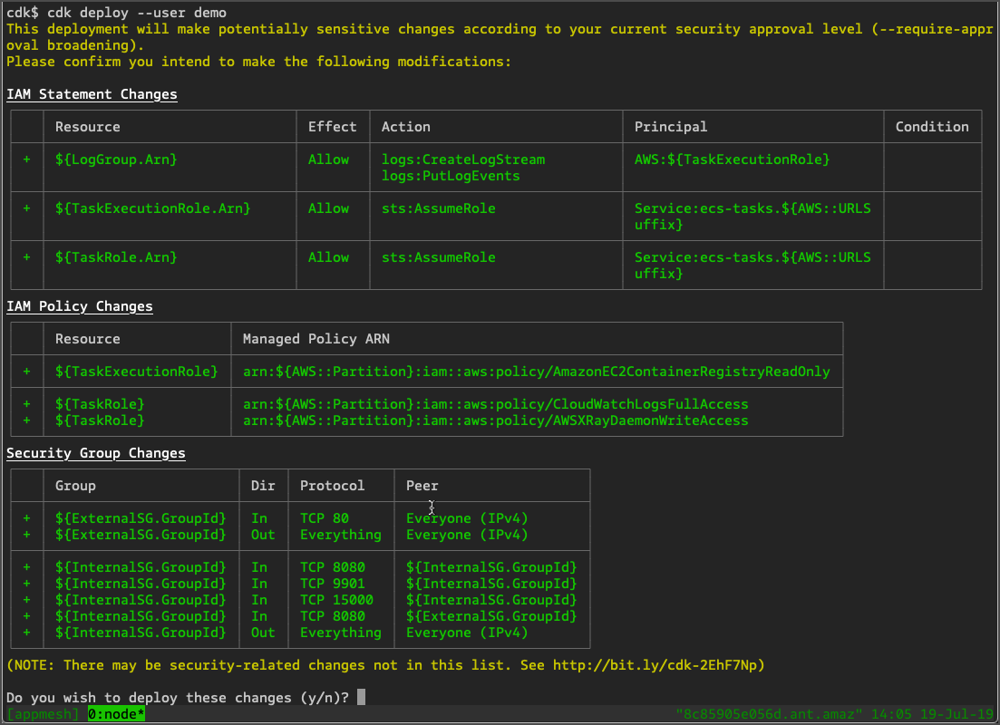
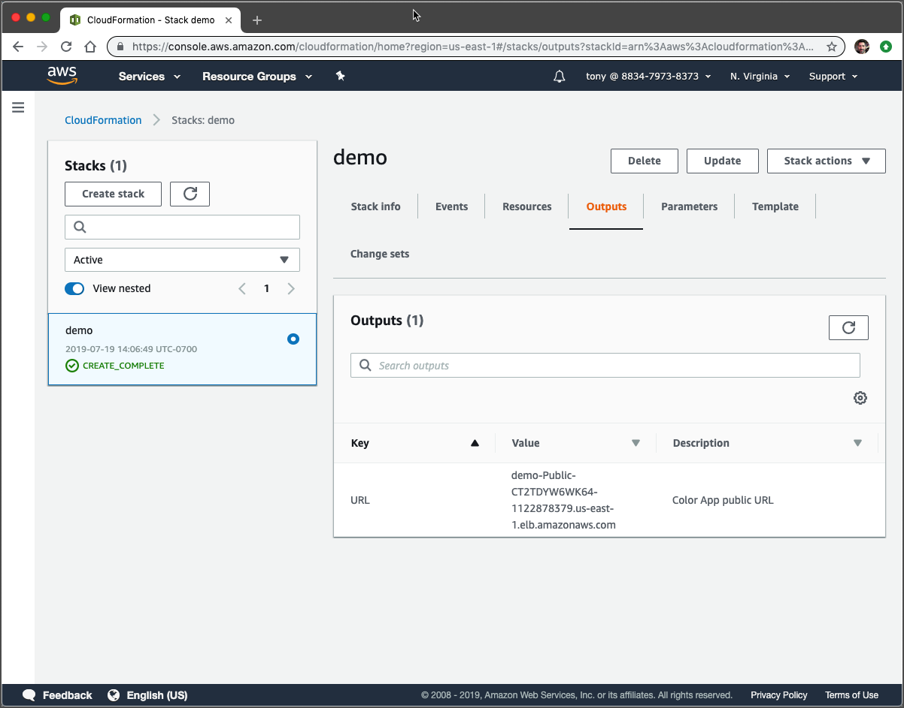

# Getting Started

We’re going to walk through using the AWS console to enable App Mesh for our demo. To make it easy to get started, we’ll first use the CDK to launch an application and get it running on Fargate. From that point on, we’ll do the rest of our work in the console.  
  
For getting started, [this CDK script](https://github.com/subfuzion/enable-appmesh/blob/master/cdk/lib/mesh-demo-stack.ts) is used to provision the resources needed for a typical, highly available application on AWS. The script takes care of the standard boilerplate so we can focus on the demo.  


* A VPC with two private subnets spread across two availability zones for our services.
* An internet gateway, two NAT gateways, and a public-facing load balancer for incoming web traffic.
* Task definitions for **gateway** and two different versions of **colorteller**.
* Fargate services are launched with tasks created from these task definitions. Their service names are registered in the **mesh.local** namespace.
* A basic App Mesh configuration. You need to have a service mesh before you can mesh-enable task definitions in the console.

#### Steps

1. Follow the steps for [Getting Started with the AWS CDK](https://docs.aws.amazon.com/cdk/latest/guide/getting_started.html).
2. Clone the [demo repo](https://github.com/subfuzion/enable-appmesh) from GitHub.
3. Ensure your environment is configured, as described [here](https://docs.aws.amazon.com/cdk/latest/guide/getting_started.html#getting_started_credentials).

Once your environment is configured for your AWS profile, you can launch the demo app. This example assumes you have a profile named demo configured to use us-east-1.  


```text
$ cd cdk
cdk $ cdk deploy --user demo
```

You’ll see something like this:



After confirming you want to make changes, CDK will begin deploying the stack. The process will take around ten minutes. Once it’s finished, CDK will print the public URL for the deployment, which you can use to access the demo.  


```text
✅ demo

Outputs:
demo.URL = demo-Public-CT2TDYW6WK64-1122878379.us-east-1.elb.amazonaws.com
```

  
You can also view that stack and get the URL using the CloudFormation dashboard in the console.



The public endpoints for the app are:

* `/color`- fetch a color
* `/color/clear`- reset the color history

Using this example URL, you can test the color endpoint with curl:

```text
$ export demo=demo-Public-CT2TDYW6WK64-1122878379.us-east-1.elb.amazonaws.com
$ curl $demo/color
{"color":"blue", "stats": {"blue":1}}
```

  
The **gateway** service sends requests to fetch a color from **colorteller.mesh.local**. The app is taking advantage of ECS service discovery, which registers the IP address of each new task that starts up for a service into DNS. As tasks scale up and down, ECS ensures that gateway requests will get routed to a running colorteller task.  
  
Our CDK script also deployed an alternate version of the colorteller that always responds with green. However, it is not wired up into routing and we will only see blue results for now, no matter how many times we request a color. Once we enable App Mesh, we will distribute traffic between these two alternate versions.  


```text
$ for i in {1..10}; do curl $demo/color; done
{"color":"blue", "stats": {"blue":1}}
{"color":"blue", "stats": {"blue":1}}
{"color":"blue", "stats": {"blue":1}}
{"color":"blue", "stats": {"blue":1}}
{"color":"blue", "stats": {"blue":1}}
{"color":"blue", "stats": {"blue":1}}
{"color":"blue", "stats": {"blue":1}}
{"color":"blue", "stats": {"blue":1}}
{"color":"blue", "stats": {"blue":1}}
{"color":"blue", "stats": {"blue":1}}
```

## 

