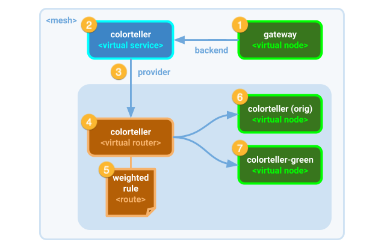

# The App Mesh model

We walked through the steps needed to configure App Mesh to shift traffic between the first version of our colorteller and the second. Let’s discuss how App Mesh uses and applies a mesh specification.  
  
The App Mesh specification for the demo that we configured in the console is based on an abstract model of our application communication requirements and policies. The logical resources that we configured reflect the full set of all available App Mesh resources available for representing services and managing application traffic.  

This is different model from either the programming model or the physical infrastructure model. It is this abstract model that allows App Mesh to compute the specific, relevant configuration it needs to distribute to each affected Envoy proxy running as a sidecar within each service’s task replica. Here’s how it works:  
  
**\(1\)** A virtual node represents the set of all healthy task replicas associated with a specific version of deployed code that has an Envoy proxy sidecar associated with. In this case, the gateway virtual node specification provides information about its communication requirements that App Mesh will ensure is applied to each running task replica of the gateway service in the mesh.  
  
The code for gateway sends requests to a backend associated with a service name \(in this case, the service name it is configured to use is a DNS hostname **colorteller.mesh.local.**The actual endpoint that the gateway service will use is **colorteller.mesh.local:8080**, because 8080 is the port that we chose for internal communication\). The virtual node configuration for **gateway** specifies that **colorteller.mesh.local** is a backend.  
  
This is important because App Mesh uses Envoy proxies to perform client-side routing. App Mesh listens to the service discovery provider \(AWS Cloud Map\) for changes in IP information related to a registered name. Each time a new backend task is created, ECS registers its IP address and App Mesh will be notified. App Mesh knows which virtual node is associated with these tasks. In fact, it can even filter specific tasks based on a Cloud Map service name attribute, as we saw in the walkthrough earlier. If it is a backend for any other virtual nodes, then App Mesh will send updated IP information to all affected task proxies in the mesh \(i.e., all tasks associated the virtual node specification that declared that the _backend_ dependency.  
  
**\(2\)** For App Mesh to actually know what service name updates to listen for, there needs to be a _virtual service_ spec. This spec declares the service name and the provider that App Mesh to determine exactly what routing information it generate and send the consumer node \(gateway\).  
  
If the provider for the virtual service is another virtual node, then the IP configuration for communicating with all tasks associated with that virtual node \(for example, **colorteller**\) will get pushed out to all tasks associated with the consuming virtual node \(**gateway**\). By default, the Envoy proxy for each gateway task will apply round-robin load-balancing as it makes requests to backend tasks using the IP addresses it was given.  
  
**\(3, 4, 5\)** The alternative to using a virtual node as a provider is to use a virtual router, as in this case. A virtual router is an abstract resource used to apply route rules that distribute traffic among a set of \(one or more\) virtual nodes. In our demo, we apply a route rule based on an HTTP path, which in this case is simply the root path “/”; the action for our rule specifies using a weighted distribution of traffic between a set of virtual nodes.  
  
**\(6, 7\)** The target of the route rules that we applied to the virtual router scoped to a virtual service \(as its provider\). In this case we specified that we wanted traffic distributed among **colorteller** \(the original virtual node\) and **colorteller-green** \(our “updated” node for the canary release we tested\). These provide the spec for the mapping to the tasks that App Mesh is monitoring for updated IP information. As new colorteller tasks start or stop, ECS registers or unregisters their IP addresses from service discovery, and updates all consuming tasks as described in \(1\).

