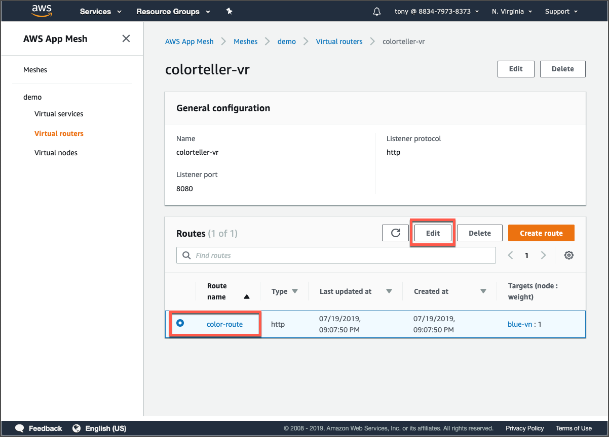
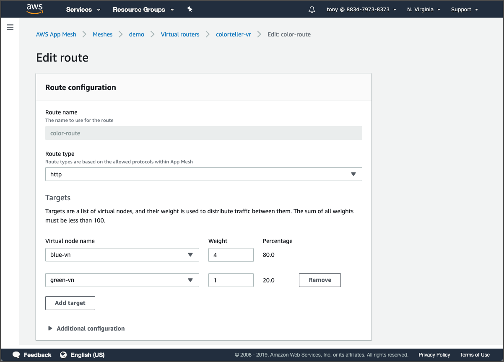

# Canary release with App Mesh

Under the **Virtual routers** page in the App Mesh console, click **colorteller-vr** to go its page and then select **color-route**. Click the **Edit** button to update its rules.



On the page that displays next, click the **Edit** button so we can update the HTTP route rule that is configured here. Add a green virtual node target, and select a weight. For this example, we’ll choose a 4:1 ratio, simulating a canary release. You can use any integer ratio you prefer \(such as 80:20\) as long as the sum is not greater than 100. Click **Save** when finished.



App Mesh is highly optimized to distribute these updates through your mesh quickly. Go back to your terminal and run curl again with enough repetitions to confirm the canary works:  


```text
$ curl $demo/color/clear
cleared
$ for i in {1..200}; do curl $demo/color; done
{"color":"blue", "stats": {"blue":1}}
{"color":"green", "stats": {"blue":0.5,"green":0.5}}
...
{"color":"green", "stats": {"blue":0.79,"green":0.21}}
```

  
In our simplistic testing scenario we just want to confirm that we get green responses; we can observe with these results that the canary is performing admirably!  
  
Finally, update the route to send all traffic to the green virtual node. You can choose a 0:1 ratio or delete the blue virtual node altogether.

```text
$ curl $demo/color/clear
cleared
cdk$ for i in {1..200}; do curl $demo/color; done
{"color":"green", "stats": {"green":1}}
{"color":"green", "stats": {"green":1}}
...
{"color":"green", "stats": {"green":1}}
```

  
Will one hundred percent of traffic shifted to green tasks now, everything looks good, as we expected.

