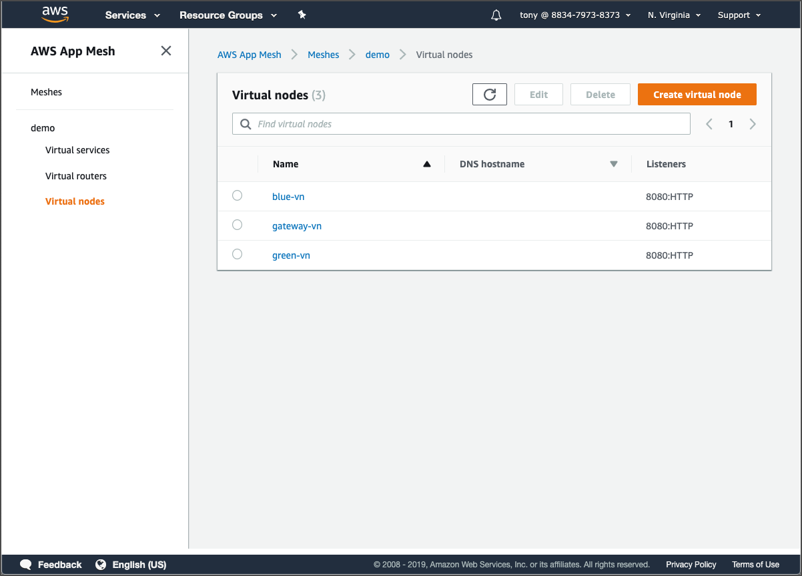

# Configure the mesh

Go the App Mesh console and then navigate to **gateway-vn** under **Virtual nodes**. We’ll prepare the virtual node for our gateway tasks. It will be the same workflow for each of the other two virtual nodes as well.

Click the **Edit** button and on the **Edit virtual node** page, select **AWS Cloud Map** for the service discovery method. Set the values as shown here:

Save the changes and repeat the workflow for the other two virtual nodes \(**blue-vn** and **green-vn**\). Make sure to use the following values for the virtual nodes:  
  
**blue-vn**  
Service name: colorteller  
ECS\_TASK\_DEFINITION\_FAMILY: blue  
  
**green-vn**  
Service name: colorteller-green  
ECS\_TASK\_DEFINITION\_FAMILY: green

### 

