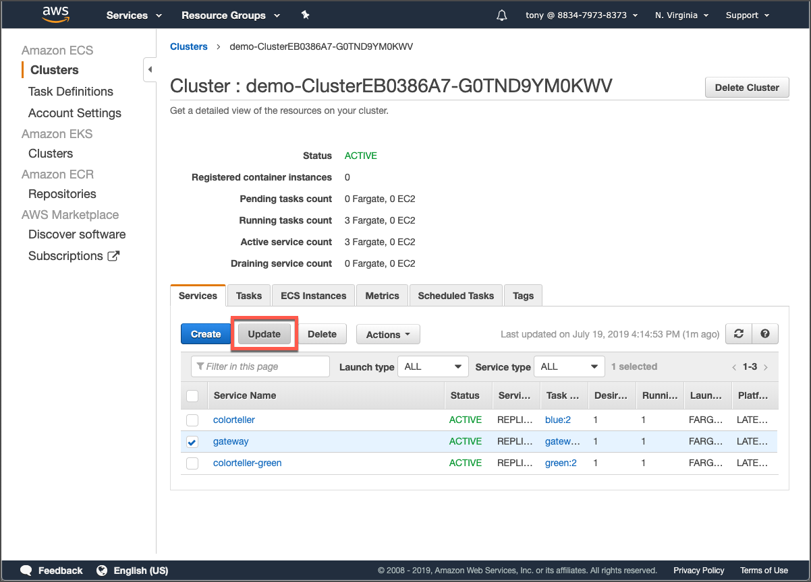
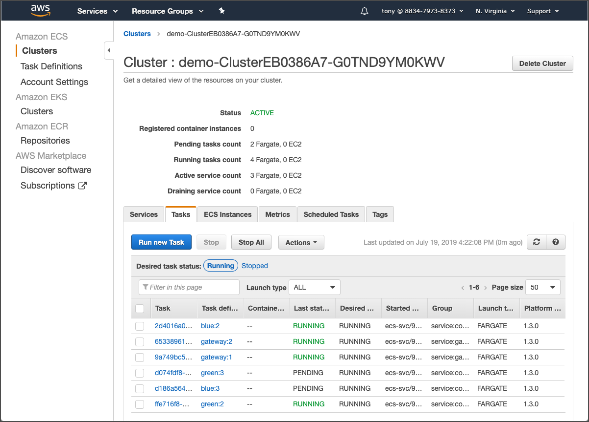

# Update services

Once our task definitions have been updated, we can update our services. Return to the **Clusters** page for the demo cluster. We’ll update the **gateway** service here. It will be the same workflow for the other two services as well.  
  
Check the **gateway** service, then click the **Update** button.



The only change here is to ensure you select the latest revision of the gateway Task Definition.


Scroll to the bottom of the page, click **Skip to review**, then click scroll to the bottom of the final page and click **Update Service.**  
  
Repeat this workflow for the other two services \(**colorteller** and **colorteller-green**\).  
  
Return to the **Cluster** page for the demo cluster, then click the **Tasks** tab.  
  
We can see that new tasks are starting for our updated services. As these tasks become healthy, the older tasks will gradually be stopped. This process can take several minutes as the Envoy image is pulled, and new tasks with both app and Envoy containers are started and become healthy.



It isn’t necessary to wait for the old tasks to drain; once the new tasks report that they’re RUNNING, we can test the app and confirm it still works.

```text
$ curl $demo/color/clear
cleared
$ for i in {1..10}; do curl $demo/color; done
{"color":"blue", "stats": {"blue":1}}
{"color":"blue", "stats": {"blue":1}}
...
```

### 

