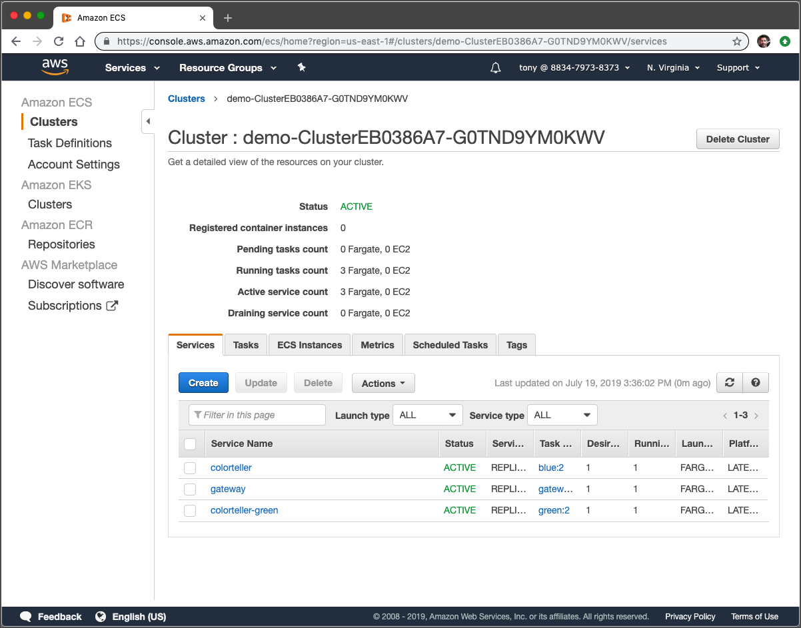
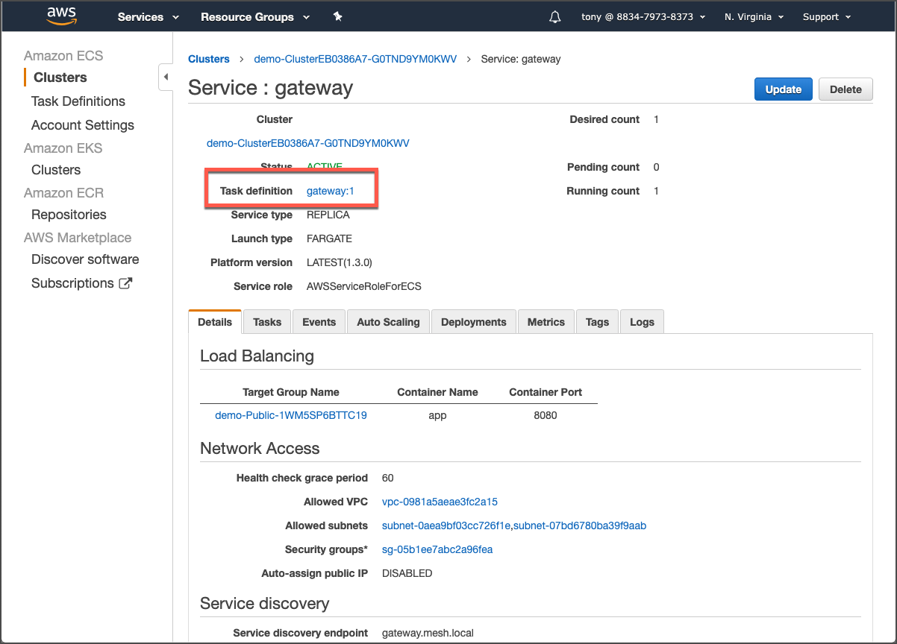
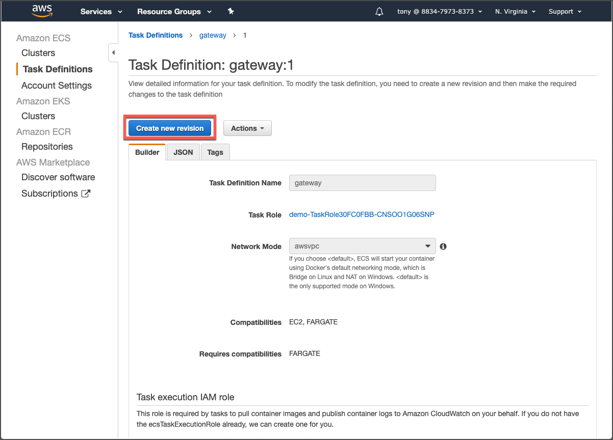
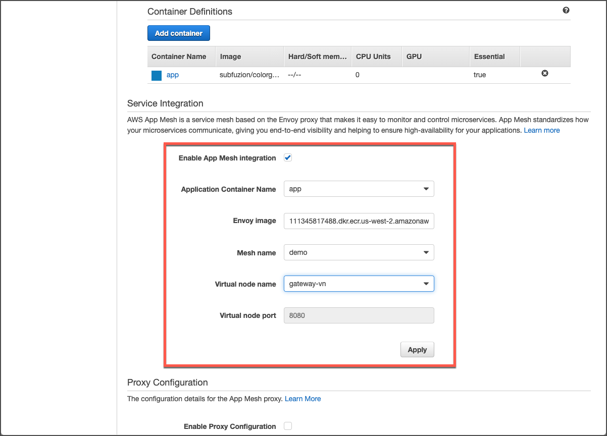

# Update task definitions

Go to the ECS console and navigate to the cluster that was just deployed.

We will enable App App mesh here for the gateway task definition. It will be the same workflow for the colorteller and colorteller-green task definitions.  
  
Click on the **gateway** service name to navigate to its service page. Then click on the **Task definition** link, shown below:

Click the **Create new revision** button.

In the **Create new revision of Task Definition** page, scroll down until you see the option to **Enable App Mesh Integration**. Check the option and additional fields will display, Update the dropdown fields to match the following:

What we are doing here is designating the primary app container for the task \(there is only one here\), the Envoy image to use for the service proxy \(we recommend using the one that is pre-filled\), the mesh that we want new tasks to be a part of, the virtual node that will be used to represent this task in the mesh, and the virtual node port to use to direct traffic to the app container \(there is only one here\).  
  
Click the **Apply** button. A dialog will pop up showing the changes that will be made to add Envoy. **Confirm** the changes, scroll to the bottom of the page, and finally click the **Create** button.  
  
Repeat this process for the other task definitions. You can find them as shown above for **gateway** by clicking on the **colorteller** and **colorteller-green** services, or you can go to them directly under the **Task Definitions** page.

